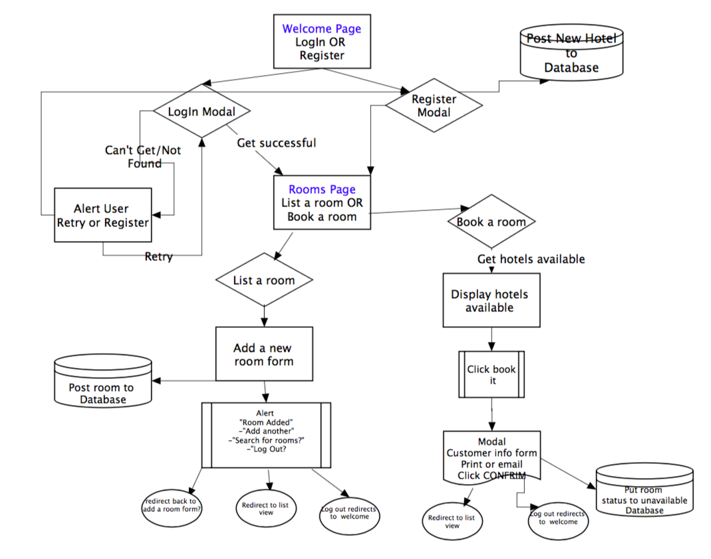

<h1>eWalk.io</h1>
<h2>Overview</h2>
<li>
  <ul>eWalk.io is an application built for the hotel industry. In the hustling and bustling city of Orlando, it is very common for hotels to become overbooked.  When this occurs, the current industry standard is to call around local hotels to find rooms for their clients.  This takes time and can leave customers feeling frustrated and angry. On the contrary, some hotels might be under-booked due to cancellations and need to fill up a room.  If this happens, they can post their vacant rooms on our site, making them available to all nearby hotels.  </ul>

  <ul>eWalk.io solution was to have an online application where hotel staff can search for vacant rooms with a click of a button.  This saves time because users simply need to log on and search for all available rooms at one time.  Then, they are able to book the room online. In contrast, if they have to fill a room, they can easily post the room to our website and make it available to nearby hotels.  </ul>
</li>

<h2>Technologies Used:</h2>
<li>
  <ul>Node.js-
We used the following npm packages: Express, Body-parser, mysql2, Passport, Passport-local, Sequelize.  To run this application on your local computer do: git clone, git init and then run 'nodemon server.js' in the command line.

  </ul>
  <ul>MySQL- database management system. </ul>
  <ul>Sequelize- a promise-based ORM for Node.js </ul>
  <ul>Passport.js- authentication middleware for Node.js</ul>
  <ul>Postman - Google Chrome app for interacting with HTTP APIs</ul>
  <ul>Materialize- CSS framework based on Material Design by Google</ul>
</li>

<h2>User Interface</h2>

We wanted the user interface to be simple and easy to use.  When your hotel is overbooked or you're looking to fill a vacant room, you need something fast and easy to use. We drew out a flow chart of our app using <em>Gliffy Diagrams</em>.

<h2>eWalk.io can be found on Heroku at https://fast-wildwood-25635.herokuapp.com/</h2>
<!--

Credit: This is a clipart image and can be found at: 
 http://weclipart.com/gimg/A425F14D40565938/il_340x270.558688970_2sb2.jpg

 -->

<footer>eWalk.io Team members: Heather Mathies| Eric Matson| Misael Rivera</footer>
